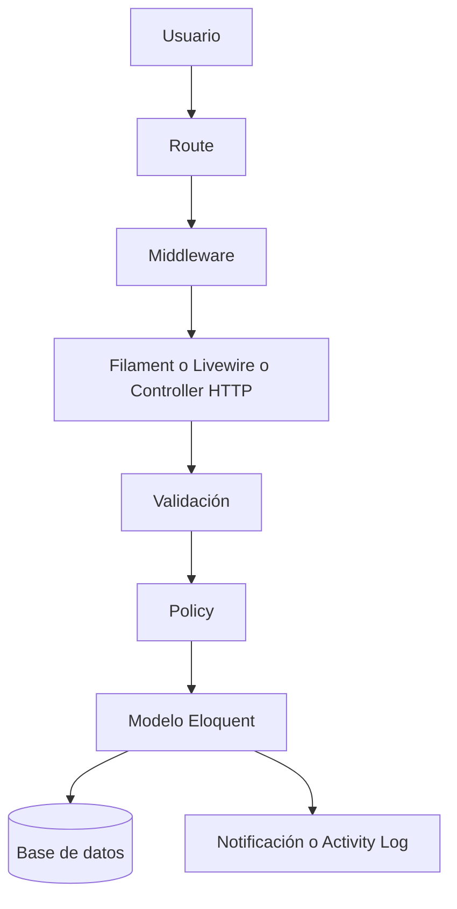

# 🏢 HRFlow

Plataforma web multi-tenant de gestión de recursos humanos, desarrollada con Laravel y Filament como Trabajo de Fin de Máster.

HRFlow demuestra la construcción de una aplicación empresarial real aplicando principios SOLID, arquitectura pragmática, Security by Design y herramientas modernas de calidad de software. El proyecto no es comercial; su objetivo es académico y de portfolio profesional.

La aplicación cubre el ciclo operativo principal de RR. HH. dentro de una empresa: estructura organizativa, gestión de empleados, control horario, solicitudes, documentación, calendario laboral, turnos y trazabilidad. Todo ello se ofrece en dos superficies coordinadas: un backoffice administrativo y un portal de autoservicio para la plantilla.

---

## 🎯 Resumen funcional y técnico

### Qué resuelve

HRFlow centraliza procesos que normalmente quedan repartidos entre correos, hojas de cálculo, carpetas compartidas y herramientas aisladas. El sistema permite gestionar personas, tiempo, documentación y supervisión operativa desde un único entorno con aislamiento completo por empresa.

### Superficies de uso

- **Backoffice (Filament):** orientado a administración de empresa, RR. HH. y responsables con permisos internos.
- **Portal del empleado (Livewire):** orientado a fichaje, solicitudes, consulta documental y calendario personal.
- **Integraciones futuras:** la arquitectura deja preparada una futura API REST para consumo externo, fuera del alcance actual del MVP.

### Perfiles principales

- **Super-admin:** visión global de la plataforma y de todos los tenants.
- **Company Admin:** gestión completa de su empresa.
- **HR:** operaciones de RR. HH. dentro del tenant.
- **Department Manager:** seguimiento de su departamento y de los usuarios bajo su ámbito.
- **Employee:** acceso exclusivo a su portal personal.

### Flujo principal de uso

1. Un perfil interno configura empresa, departamentos, usuarios, turnos y festivos desde el backoffice.
2. Los empleados acceden al portal de su empresa mediante una URL tenant-aware.
3. Desde el portal registran la jornada, envían solicitudes, consultan documentos y revisan su calendario.
4. Los perfiles autorizados revisan solicitudes, controlan la actividad y mantienen la información operativa.
5. Las acciones relevantes quedan protegidas por policies y registradas en auditoría.

### Decisiones de diseño destacadas

- **Modelo unificado de usuario:** en el MVP, `User` representa tanto la identidad autenticable como el perfil laboral.
- **Multi-tenancy por columna:** el aislamiento se implementa con `tenant_id`, scopes tenant-aware, middleware y policies.
- **Arquitectura Laravel-native:** la lógica se apoya principalmente en modelos, policies, Form Requests, componentes Livewire y recursos Filament, evitando capas artificiales.
- **Separación de interfaces:** backoffice y portal comparten dominio, pero responden a necesidades de uso diferentes.

### Flujo técnico resumido



---

## 📋 Características

### Backoffice (Filament v4)

- Gestión de empresas (tenants) con aislamiento total de datos
- Gestión de usuarios/empleados con perfiles laborales (código, puesto, departamento, fecha de contratación)
- Gestión de departamentos con responsable asignado
- Gestión documental (nóminas, contratos, normativas, otros)
- Control de solicitudes de vacaciones y permisos retribuidos
- Gestión de registros horarios (fichajes)
- Reporting básico de control horario con Partes de horas (filtros por empleado/año/mes, gráfico diario y resumen mensual)
- Gestión de turnos y asignaciones de turno por empleado con vigencia temporal
- Gestión de festivos por empresa
- Sistema de roles y permisos granulares

### Portal del Empleado (Livewire)

- Control de horario en tiempo real (entrada / salida con polling automático)
- Consulta y gestión de solicitudes de ausencia
- Descarga de documentación personal
- Calendario laboral con eventos de ausencias y festivos
- Notificaciones en tiempo real
- Vista de Partes de horas por empleado con desglose diario y resumen mensual

### Integraciones futuras

- Se reserva `routes/api.php` para una futura API REST orientada a integraciones externas
- La gestión programática de usuarios y departamentos queda como evolución futura

### Multitenancy

- Aislamiento total de datos por empresa
- Resolución de tenant por ruta (`/portal/{tenant}`)
- Middleware de verificación de pertenencia al tenant

### Calidad y automatización

- 19 suites de tests PHPUnit
- Tests end-to-end con Playwright (autenticación, fichajes, solicitudes)
- 4 GitHub Actions configurados
- 4 agentes de IA especializados (Code Reviewer, Full Stack Developer, Architect, Test Engineer)
- MCP server (Laravel Boost) para asistencia técnica basada en documentación oficial

### Reporting implementado

- Módulo **Partes de horas** integrado en Filament dentro de **Control de tiempo**
- Filtros por empleado, año y mes
- Gráfico de barras con todos los días del mes (incluye días sin fichaje en 0)
- Resumen mensual con horas totales, media diaria y días trabajados
- Aislamiento multi-tenant y control de acceso por rol aplicados en consultas y visualización

---

## 🏛 Arquitectura

HRFlow es un monolito modular sobre Laravel 13. La aplicación no introduce una capa de servicios transversal como patrón obligatorio; la orquestación vive principalmente en controladores, componentes Livewire, recursos Filament y modelos con invariantes de dominio.

El proyecto sigue una arquitectura en capas apoyada en las convenciones del framework Laravel:

| Capa | Responsabilidad | Elementos principales |
|---|---|---|
| Presentación | Entrada HTTP, validación de formato | Controllers, Livewire Components, Filament Resources |
| Aplicación | Orquestación de casos de uso | Controllers, acciones de Livewire, Resource Pages, Form Requests |
| Dominio | Reglas de negocio, invariantes | Models, Enums, Policies |
| Infraestructura | Persistencia, notificaciones, archivos | Eloquent, autenticación web, ActivityLog |

**Decisiones arquitectónicas destacadas:**

- **User como entidad unificada:** en el MVP, `User` modela tanto la identidad autenticable como el perfil laboral del empleado. Esta decisión simplifica el dominio y facilita la demostración académica.
- **Multi-tenancy por columna:** aislamiento mediante `tenant_id` en cada entidad de negocio, con scopes de visibilidad, middleware y `Policies` tenant-aware.
- **Backoffice y portal separados:** Filament para administración, Blade + Livewire para el portal del empleado.
- **Lógica cerca del dominio:** validaciones de entrada en Form Requests o Livewire, invariantes en modelos y autorización transversal en policies.

---

## 🛠 Tecnologías

| Tecnología | Versión | Propósito |
|---|---|---|
| PHP | 8.3 | Lenguaje de programación |
| Laravel | 13 | Framework principal |
| Filament | 4 | Panel de administración |
| Livewire | 3 | Componentes reactivos en el portal |
| Alpine.js | — | Interacciones de UI ligeras |
| Tailwind CSS | 4 | Sistema de diseño utilitario |
| Vite | 8 | Bundler de assets |
| MariaDB | — | Base de datos de producción |
| SQLite | — | Base de datos de desarrollo y CI |
| stancl/tenancy | 3 | Arquitectura multi-tenant |
| spatie/laravel-permission | 8 | Roles y permisos |
| spatie/laravel-activitylog | 4 | Auditoría de acciones |
| PHPUnit | 12 | Tests unitarios y de integración |
| Playwright | 1.54 | Tests end-to-end |
| PHPStan + Larastan | 2 / 3 | Análisis estático de tipos |
| Laravel Pint | 1 | Formateador de código PHP |
| ESLint | 10 | Linter de JavaScript |
| GitHub Actions | — | Integración continua y despliegue |
| Laravel Boost | 2 | MCP server de asistencia técnica |

---

## ⚙️ Instalación

### Requisitos previos

- PHP 8.3 o superior
- Composer
- Node.js 22 o superior
- MariaDB (producción) o SQLite (desarrollo)

### Instalación con script de configuración automática

```bash
git clone https://github.com/avidal90/hrflow.git
cd hrflow
composer run setup
```

El script `composer run setup` ejecuta automáticamente: instalación de dependencias, copia de `.env`, generación de clave, migración y compilación de assets.

### Instalación manual paso a paso

```bash
# 1. Clonar el repositorio
git clone https://github.com/avidal90/hrflow.git
cd hrflow

# 2. Instalar dependencias PHP
composer install

# 3. Instalar dependencias JavaScript
npm install

# 4. Configurar variables de entorno
cp .env.example .env
php artisan key:generate

# 5. Crear base de datos (SQLite para desarrollo)
touch database/database.sqlite

# 6. Ejecutar migraciones
php artisan migrate

# 7. Poblar datos de demostración
php artisan db:seed

# 8. Compilar assets
npm run build

# 9. Arrancar el servidor de desarrollo
composer run dev
```

El comando `composer run dev` inicia en paralelo: servidor HTTP, queue worker, log viewer (Pail) y Vite.

---

## 🌐 Demo en producción

La aplicación está desplegada en IONOS. Puedes acceder directamente sin necesidad de instalación local.

**URL base:** [https://home-5020875424.app-ionos.space](https://home-5020875424.app-ionos.space)

### Accesos rápidos para evaluación

| Rol | Email | Empresa | Enlace directo |
|---|---|---|---|
| Employee | `javier.ramos@northwind.local` | Northwind HR | [Portal Northwind](https://home-5020875424.app-ionos.space/portal/northwind-demo/login) |
| Department Manager | `maria.santos@northwind.local` | Northwind HR | [Portal Northwind](https://home-5020875424.app-ionos.space/portal/northwind-demo/login) |
| Company Admin | `sofia.fernandez@acme.local` | Acme People | [Portal Acme](https://home-5020875424.app-ionos.space/portal/acme-demo/login) |
| Employee | `pablo.herrero@acme.local` | Acme People | [Portal Acme](https://home-5020875424.app-ionos.space/portal/acme-demo/login) |

**Contraseña:** `Hr@Flow2026!`

> Javier Ramos y Pablo Herrero tienen historial de solicitudes de ausencia y 15 días de registros horarios precargados para una evaluación completa del portal de empleado.

**Backoffice (Filament):** [https://home-5020875424.app-ionos.space/login](https://home-5020875424.app-ionos.space/login)
Acceso con `admin@hrflow.local` / `Hr@Flow2026!`

---

## ⚙️ Configuración

### SQLite (desarrollo)

El entorno de desarrollo usa SQLite para simplificar la configuración. Basta con crear el archivo:

```bash
touch database/database.sqlite
```

Y configurar `.env`:

```env
DB_CONNECTION=sqlite
DB_DATABASE=/ruta/absoluta/al/proyecto/database/database.sqlite
```

### MariaDB (producción)

Para producción, configura las variables en `.env`:

```env
DB_CONNECTION=mariadb
DB_HOST=127.0.0.1
DB_PORT=3306
DB_DATABASE=hrflow
DB_USERNAME=tu_usuario
DB_PASSWORD=tu_contraseña
```

### Usuarios de demostración

Tras ejecutar `php artisan db:seed`, el sistema crea 9 usuarios predefinidos:

**Northwind HR** — Portal: `/portal/northwind-demo/login`

| Email | Nombre | Rol | Puesto |
|---|---|---|---|
| `ana.gomez@northwind.local` | Ana Gómez | Company Admin | Directora General |
| `luis.martin@northwind.local` | Luis Martín | HR | Técnico de RRHH |
| `maria.santos@northwind.local` | María Santos | Department Manager | Responsable de RRHH |
| `javier.ramos@northwind.local` | Javier Ramos | Employee | Administrativo de RRHH |

**Acme People** — Portal: `/portal/acme-demo/login`

| Email | Nombre | Rol | Puesto |
|---|---|---|---|
| `sofia.fernandez@acme.local` | Sofía Fernández | Company Admin | Directora de Operaciones |
| `carlos.ortega@acme.local` | Carlos Ortega | HR | Técnico de Personas |
| `nuria.lopez@acme.local` | Nuria López | Department Manager | Responsable de Administración |
| `pablo.herrero@acme.local` | Pablo Herrero | Employee | Auxiliar Administrativo |

Contraseña de todos los usuarios demo: `Hr@Flow2026!`

Los usuarios empleados (`javier.ramos` y `pablo.herrero`) tienen datos de demostración precargados: historial de solicitudes de ausencia y registros horarios de los últimos 15 días laborables.

---

## ✅ Calidad del código

El proyecto cuenta con una cadena de herramientas de calidad que se ejecuta en cada push.

### Laravel Pint

Formateador de código PHP basado en PHP-CS-Fixer con el preset de Laravel.

```bash
# Comprobar estilo sin modificar
vendor/bin/pint --test

# Corregir automáticamente
vendor/bin/pint
```

### PHPStan + Larastan

Análisis estático de tipos configurado en **nivel 6**, incluyendo el plugin de Laravel para reconocimiento de helpers y Eloquent.

```bash
vendor/bin/phpstan analyse
# alias
composer analyse
```

### ESLint

Linter de JavaScript para los archivos en `resources/js`.

```bash
# Comprobar
npm run lint

# Corregir automáticamente
npm run lint:fix
```

### PHPUnit

Tests de integración y unitarios. La suite cubre:

- Autorización y aislamiento entre tenants
- Flujos del portal del empleado (fichaje, solicitudes, documentos, calendario)
- Recursos Filament (queries, filtros, etiquetas, gestión de tenants)
- Integraciones futuras
- Gestión documental
- Módulo de turnos
- Protección de datos sensibles de usuario
- Seeders

```bash
# Ejecutar todos los tests
php artisan test --compact

# Filtrar por nombre
php artisan test --compact --filter=TenantIsolation

# Ejecutar un archivo concreto
php artisan test --compact tests/Feature/Portal/PortalTimeTrackingTest.php
```

### Playwright

Tests end-to-end que verifican flujos reales en el navegador:

- `auth.spec.ts` — autenticación en el portal
- `time-tracking.spec.ts` — ciclo completo de fichaje
- `leave-requests.spec.ts` — solicitudes de ausencia

```bash
# Instalar navegadores (primera vez)
npm run e2e:install

# Ejecutar tests
npm run e2e

# Modo con interfaz gráfica
npm run e2e:ui

# Modo debug
npm run e2e:debug
```

---

## 🔄 Integración Continua

El proyecto tiene cuatro workflows de GitHub Actions:

| Workflow | Archivo | Propósito |
|---|---|---|
| Quality Gate | `quality-gate.yaml` | Verificación de calidad en push/PR |
| Build | `hrflow-build.yaml` | Compilación y empaquetado |
| Orchestration | `hrflow-orchestration.yaml` | Coordinación de despliegue |
| Deploy to IONOS | `deploy-to-ionos.yaml` | Despliegue automático en IONOS |

### Quality Gate

El workflow de calidad ejecuta los siguientes pasos en cada push a `main` o `develop` y en Pull Requests:

1. Instalación de dependencias PHP y Node.js
2. Preparación del entorno Laravel
3. **Laravel Pint** — verificación de estilo
4. **PHPStan / Larastan** — análisis estático
5. **PHPUnit** — suite de tests con SQLite
6. **ESLint** — análisis de JavaScript
7. **Composer audit** — auditoría de dependencias PHP
8. **NPM audit** — auditoría de dependencias JavaScript

Todos los pasos de verificación tienen `continue-on-error: true`, por lo que el pipeline completa todos los checks independientemente de los resultados individuales.

---

## 🔒 Seguridad

El proyecto aplica un enfoque de **Security by Design** desde el diseño hasta las pruebas.

### Authorization Policies

Cada modelo de negocio tiene su propia Policy (`DepartmentPolicy`, `DocumentPolicy`, `LeaveRequestPolicy`, `TimeEntryPolicy`, `TurnoPolicy`, `TurnoAssignmentPolicy`, `UserPolicy`, `TenantPolicy`, `FestivoPolicy`).

Toda acción pasa por autorización explícita con verificación simultánea de **rol + permiso + tenant**.

### Roles y permisos

Sistema granular con Spatie Laravel Permission:

| Rol | Alcance |
|---|---|
| `super-admin` | Acceso global a todos los tenants |
| `company-admin` | Gestión completa de su empresa |
| `hr` | Operaciones de RRHH dentro del tenant |
| `department-manager` | Gestión de su departamento |
| `employee` | Acceso al portal personal |

### Validación

Las operaciones HTTP del perfil usan Form Requests. Filament y Livewire validan en su propia capa y los modelos rematan invariantes sensibles antes de persistir. Los datos del usuario nunca se procesan en bruto desde `$request->all()`.

### Mass Assignment

Todos los modelos definen `$fillable` explícito. No existe ningún modelo con `$guarded = []`.

### Multitenancy y aislamiento

- Aislamiento por `tenant_id` en todas las entidades de negocio
- Scopes tenant-aware y trait `BelongsToTenant` en consultas
- Middleware `EnsureUserBelongsToTenant` en el portal
- Policies que verifican tenant + rol + propiedad o jerarquía cuando aplica
- Tests de aislamiento entre tenants (`TenantIsolationTest`)

### Auditoría

Registro de operaciones críticas con `spatie/laravel-activitylog`. Cada acción sensible incluye actor, tenant, entidad y cambios.

### OWASP Top 10

| Amenaza OWASP | Control implementado |
|---|---|
| Broken Access Control | Policies por modelo, tests de autorización |
| Injection | Uso exclusivo de Eloquent y Query Builder |
| Security Misconfiguration | Configuración por entorno, sin secrets en código |
| Identification & Authentication Failures | Sesiones web seguras, regeneración de sesión y throttle en login |
| Software & Data Integrity | Auditoría de dependencias en CI |
| Security Logging & Monitoring | ActivityLog en operaciones críticas |

---

## 📁 Estructura del proyecto

```
hrflow/
├── app/
│   ├── Enums/                  # Enums tipados (estados, tipos)
│   ├── Filament/
│   │   ├── Resources/          # Recursos del backoffice
│   │   ├── Pages/              # Páginas personalizadas
│   │   └── Widgets/            # Widgets del dashboard
│   ├── Http/
│   │   ├── Controllers/        # Controladores web y del portal
│   │   ├── Middleware/         # Middlewares personalizados
│   │   └── Requests/           # Form Requests de validación
│   ├── Livewire/Portal/        # Componentes reactivos del portal
│   ├── Models/                 # Eloquent models y reglas de dominio
│   ├── Notifications/          # Notificaciones del sistema
│   ├── Policies/               # 9 policies de autorización
│   └── Support/                # Clases de soporte
├── database/
│   ├── factories/              # Factories para tests
│   ├── migrations/             # 26 migraciones versionadas
│   └── seeders/                # Seeders idempotentes
├── knowledge/                  # Documentación técnica del proyecto
├── resources/
│   ├── css/                    # Estilos con Tailwind CSS
│   ├── js/                     # JavaScript
│   └── views/                  # Vistas Blade
├── routes/
│   ├── api.php                 # Reservado para futuras integraciones
│   ├── tenant.php              # Rutas del portal multi-tenant
│   └── web.php                 # Rutas web generales
├── tests/
│   ├── Feature/                # 19 suites de tests PHPUnit
│   └── e2e/                    # 3 suites de tests Playwright
└── .github/
    ├── agents/                 # 4 agentes de IA configurados
    ├── instructions/           # Instrucciones de codificación
    ├── skills/                 # Skills del asistente de IA
    └── workflows/              # 4 workflows de CI/CD
```

---

## 🤖 Agentes de IA

El proyecto incorpora agentes de IA especializados configurados en `.github/agents/`:

| Agente | Propósito |
|---|---|
| HRFlow Code Reviewer | Revisión de cambios con criterios de seguridad y arquitectura |
| HRFlow Full Stack Developer | Desarrollo de funcionalidades en toda la pila |
| HRFlow Software Architect | Diseño de arquitectura y modelo de datos |
| HRFlow Test Engineer | Creación y revisión de tests |

Junto con **Laravel Boost** (MCP server), estos agentes permiten asistencia técnica contextualizada y guiada por documentación oficial del stack instalado.

---

## 🗺 Roadmap

Las siguientes funcionalidades están planificadas para completar el MVP:

- [x] Módulo de reporting básico: Partes de horas (resumen de horas por día y mes)
- [ ] Ampliar reporting (vacaciones y ausencias)
- [ ] Organigrama empresarial visual
- [ ] Endurecimiento del aislamiento multi-tenant en formularios Filament (normalización server-side de `tenant_id`)
- [ ] API REST para integraciones externas y emisión controlada de credenciales
- [ ] Cifrado en reposo de datos personales sensibles
- [ ] Calendario laboral con integración completa de turnos

---

## 📚 Aprendizajes

Este proyecto demuestra dominio práctico de:

- **Laravel avanzado:** multi-tenancy, Policies, Form Requests, Eloquent avanzado, ActivityLog y diseño Laravel-native orientado al MVP
- **Filament v4:** recursos, relation managers, filtros de tabla, acciones, schemas
- **Livewire 3:** componentes reactivos, polling, paginación
- **Principios SOLID:** aplicados de forma pragmática en policies, recursos, componentes y casos de uso
- **Security by Design:** threat modeling por módulo, OWASP Top 10, aislamiento multi-tenant
- **Testing profesional:** PHPUnit (feature + integration), Playwright (e2e), cobertura de flujos críticos
- **Calidad de código:** Pint, PHPStan nivel 6, ESLint, auditorías de dependencias
- **CI/CD:** GitHub Actions con múltiples workflows para calidad y despliegue automático
- **Inteligencia Artificial aplicada:** agentes especializados y MCP server en el flujo de desarrollo

---

## 👤 Autor

Desarrollado por **Antonio Vidal Iglesias** como Trabajo de Fin de Máster.

- GitHub: [@avidal90](https://github.com/avidal90)

---

## 📄 Documentación adicional

Url Slides: https://docs.google.com/presentation/d/11tG9tIzNledd0GXHhBOHzkUaBlPPW4R4/edit?usp=drive_link&ouid=104874272346714045442&rtpof=true&sd=true

Url Video: https://drive.google.com/file/d/1hslp9G9Rh6GVU_gdw51kacHi7h0OvWgK/view?usp=drive_link

