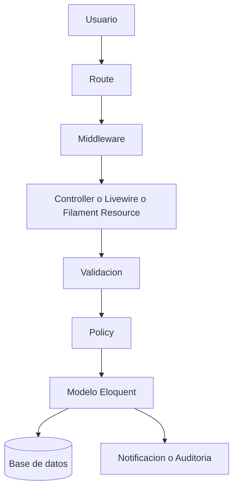
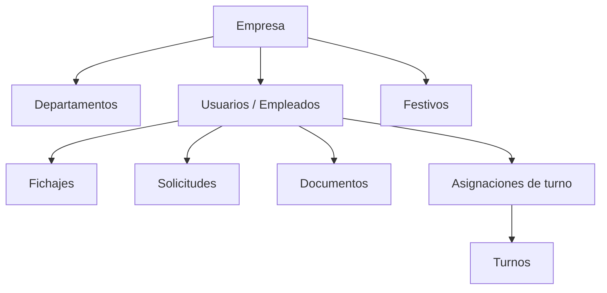
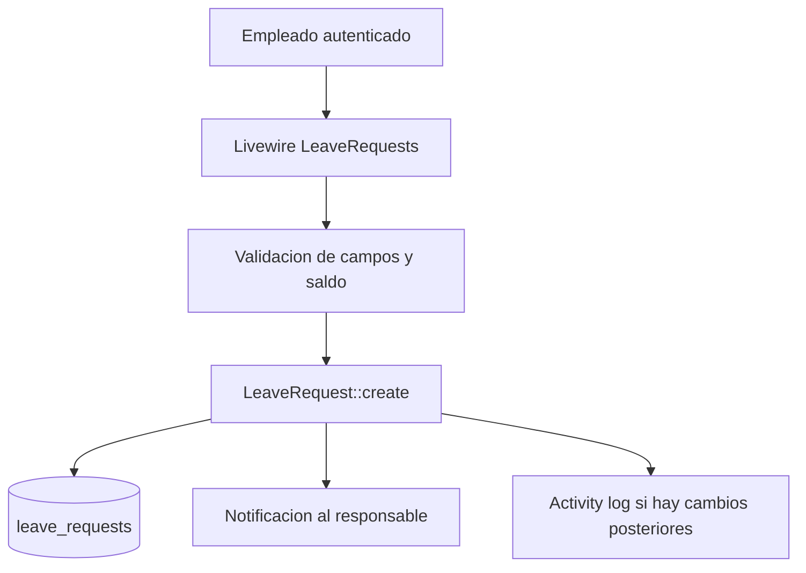

# HRFlow

HRFlow es una aplicacion SaaS multi-tenant de recursos humanos construida sobre Laravel 13, Filament 4 y Livewire 3. Su responsabilidad tecnica es ofrecer dos superficies coordinadas, un backoffice administrativo y un portal del empleado, compartiendo el mismo dominio, las mismas reglas de autorizacion y el mismo modelo de datos aislado por empresa.

Dentro del sistema actua como una aplicacion monolitica modular. La mayor parte de la logica operativa se apoya en convenciones nativas de Laravel, policies, modelos Eloquent, componentes Livewire y recursos Filament, evitando capas adicionales cuando no aportan valor al MVP.

# Objetivo tecnico

El objetivo tecnico de HRFlow es centralizar la gestion de personas, tiempo, documentacion y estructura organizativa en una arquitectura unica, mantenible y segura, con aislamiento estricto por tenant.

Dentro de la arquitectura global, la aplicacion asume cinco responsabilidades tecnicas principales:

- Resolver el contexto de empresa y aplicarlo a lectura, escritura y autorizacion.
- Exponer interfaces diferenciadas para administracion y autoservicio.
- Encapsular reglas operativas en modelos, policies, requests y componentes.
- Garantizar trazabilidad de acciones sensibles mediante activity log.
- Mantener una base tecnica simple, explicable y alineada con el alcance MVP del proyecto.

# Arquitectura

La aplicacion sigue una arquitectura monolitica modular basada en Laravel. No introduce una capa de servicios generalizada ni patrones enterprise innecesarios. La separacion principal se produce por tipo de interfaz y por responsabilidad tecnica.

## Arquitectura general

- Backoffice: Filament organiza CRUD, panel administrativo, widgets y reporting operativo.
- Portal del empleado: Blade + Livewire gestionan interacciones de autoservicio con estado reactivo.
- Integraciones futuras: la arquitectura puede incorporar una API REST, pero no forma parte del alcance activo del MVP.
- Dominio: modelos Eloquent con invariantes, scopes y relaciones.
- Seguridad: policies, gates implicitos, middleware y validacion.
- Infraestructura: MariaDB o SQLite segun entorno, storage privado, autenticacion web, notifications y activity log.

## Separacion por capas

- Presentacion
  Incluye rutas, controladores HTTP, componentes Livewire, recursos Filament y vistas Blade.
- Aplicacion
  La orquestacion vive sobre todo en controladores, componentes y configuracion de recursos. Es una capa ligera, coherente con KISS, sin introducir servicios genericos vacios.
- Dominio
  Se concentra en modelos, enums, scopes de visibilidad, validaciones en eventos de modelo y policies.
- Infraestructura
  Incluye Eloquent, storage, autenticacion web, Spatie Permission, Spatie Activity Log y Stancl Tenancy.

## Dependencias entre capas

- La UI administrativa depende de Filament y del dominio Eloquent.
- El portal depende de Livewire, de los modelos y de las policies.
- La eventual capa de integración externa podría reutilizar las mismas reglas de dominio, pero no está activa en el MVP.
- La persistencia depende de Eloquent y de una estrategia tenant-aware por columna tenant_id.

## Flujo de ejecucion

La decision principal es mantener la logica cerca del framework y del dominio real. Esto reduce capas artificiales, facilita la trazabilidad del flujo y hace la arquitectura mas defendible para un MVP profesional.

# Componentes

## Models

Los modelos son el eje del dominio y no se limitan a persistir datos. Contienen relaciones, scopes, invariantes y parte del comportamiento operativo.

- Tenant
  Representa la empresa y extiende el modelo tenant de Stancl Tenancy. Actua como raiz del aislamiento y centraliza metadatos como estado, idioma, zona horaria y limite de licencias.
- User
  Modela tanto la identidad autenticable como el perfil laboral. Esta decision simplifica el dominio del MVP y evita una separacion artificial entre usuario y empleado. Gestiona roles, acceso a Filament, vacaciones restantes, visibilidad por rol y relaciones con departamento, solicitudes, fichajes, documentos y turnos.
- Department
  Organiza la estructura interna y resuelve jerarquia mediante manager_user_id. Su scope de visibilidad reduce el alcance de responsables de departamento.
- LeaveRequest
  Gestiona solicitudes de vacaciones y permisos. Usa enums para tipo y estado, soft deletes y notificacion al empleado cuando cambia de estado.
- TimeEntry
  Modela el fichaje diario. Calcula automaticamente estado y duracion cuando se informa la salida y protege la coherencia temporal.
- Document
  Gestiona metadatos documentales y coordinacion con almacenamiento privado. Cuando el documento es visible para el empleado dispara una notificacion de disponibilidad.
- Turno y TurnoAssignment
  Separan catalogo de turno y asignacion temporal. Esta decision evita duplicar definiciones de turno y permite vigencias cerradas o permanentes.
- Festivo
  Aporta dias no laborables por tenant y complementa el calendario y la logica de ausencia.
- Activity
  Personaliza el activity log para incluir tenant_id e ip_address, reforzando trazabilidad.

### Relaciones principales

Empresa → usuarios, departamentos, solicitudes, fichajes, documentos, turnos y festivos.

Departamento → usuarios y responsable.

Usuario → solicitudes, fichajes, documentos y asignaciones de turno.

Turno → asignaciones.

### Scopes y traits relevantes

- BelongsToTenant
  Normaliza tenant_id en create y update para usuarios autenticados no superadmin y expone scopes de tenant y visibilidad.
- LogsTenantActivity
  Registra cambios sobre modelos auditados y añade tenant e IP al log.
- Scopes visibleTo y visibleToUser
  Trasladan el alcance por rol al nivel de consulta, reduciendo riesgo de lecturas indebidas.
- Scope activeOn en TurnoAssignment
  Resuelve la vigencia de un turno para una fecha concreta.

## Filament Resources

Filament estructura el backoffice por recurso, con separacion clara entre Resource, Pages, Schemas, Tables y Relation Managers.

- Recursos implementados
  Usuarios, departamentos, documentos, solicitudes, fichajes, turnos, festivos, tenants y activity logs.
- Pages
  Siguen el patron index, create, view y edit cuando aplica.
- Schemas y Tables
  Extraen formularios, tablas, infolists, filtros y columnas fuera de la clase Resource, mejorando legibilidad y reuso.
- Relation Managers
  En usuarios se usan para fichajes, solicitudes, documentos y asignaciones de turno. Esto encaja bien con un dominio centrado en User.
- Widgets
  Existen widgets segmentados por rol para metricas, solicitudes recientes, proximos turnos, festivos y partes de horas.

La decision de delegar configuracion a Schemas, Tables y Relation Managers es consistente con Filament 4 y evita recursos monoliticos demasiado extensos.

## Livewire

El portal del empleado se apoya en componentes Livewire especificos y acotados.

- TimeTracker
  Gestiona el ciclo entrada/salida, el refresco cada 30 segundos, el historico paginado y el resumen del turno del dia.
- LeaveRequests
  Gestiona el formulario de solicitud, el calculo de dias, la validacion de saldo y el listado historico del usuario.
- Documents
  Centraliza la vista documental del portal.
- NotificationBell
  Muestra notificaciones persistidas en base de datos.

La comunicacion entre componentes es minima. Predomina un flujo simple: el componente consulta y persiste directamente sobre modelos, con autorizacion contextual por sesion autenticada.

## Controllers

Los controladores son deliberadamente ligeros.

- PortalAuthenticatedSessionController
  Gestiona login administrativo y login tenant-aware del portal, separando ambos recorridos y evitando accesos indebidos al backoffice.
- Controladores Portal
  Resuelven renderizado de dashboard, calendario, documentos y descargas.
- ProfileController
  Gestiona perfil propio, avatar y cambio de contrasena.
- API futura
  La arquitectura conserva un punto de extension para integraciones externas, pero la capa de controladores API no forma parte del alcance activo del MVP.

## Services

Actualmente no existe una capa de servicios transversal. La aplicacion opta por una arquitectura mas directa:

- los casos simples viven en controladores o componentes;
- las invariantes viven en modelos;
- la autorizacion vive en policies.

Esta decision es razonable para el alcance actual. Evita sobreingenieria, aunque empieza a mostrar limites en flujos con notificaciones y reglas repetidas.

## Policies

Las policies son uno de los pilares reales del sistema.

- Controlan CRUD y acciones especificas como descarga documental o acceso al perfil propio.
- Aplican primero el filtro de tenant y despues el alcance funcional.
- Combinan rol, propiedad del registro y jerarquia departamental.
- Superadmin se resuelve con atajos en before, mientras que company-admin, hr, department-manager y employee se discriminan por capacidad efectiva.

La autorizacion no se queda en la UI; protege portal, backoffice y operaciones directas sobre modelos mediante Gate y can. La misma estrategia podria reutilizarse en una API futura sin rediseñar el dominio.

## Jobs

La infraestructura de colas existe en base de datos, pero no se observa un uso funcional relevante de Jobs en la implementacion actual. Esto indica una arquitectura preparada para asincronia, aunque todavia no explotada de forma sistematica.

## Events / Listeners

No hay una capa explicita de eventos y listeners de negocio desplegada como patron dominante. El sistema usa eventos de modelo y hooks de Eloquent para reacciones locales, por ejemplo:

- notificar al empleado cuando cambia el estado de una solicitud;
- notificar cuando se sube un documento visible;
- recalcular estado y duracion de un fichaje al guardar.

Es una solucion simple y coherente para el MVP, aunque acopla parte de la reaccion secundaria al modelo.

## Notifications

Las notificaciones se almacenan en base de datos y se utilizan para coordinar interacciones entre portal y backoffice.

- Solicitud enviada al responsable.
- Solicitud aprobada o rechazada al empleado.
- Documento nuevo disponible al empleado.
- Confirmacion de cambio de contrasena.

Existe una notification class dedicada para LeaveRequestSubmitted, pero en el flujo visible predominan notificaciones construidas inline con Filament Notifications.

# Modelo de datos

El modelo de datos es relacional, tenant-aware y centrado en User como empleado unificado.

Las entidades relevantes almacenan informacion operativa y de contexto, no solo relaciones tecnicas. Destacan tres decisiones:

- User absorbe identidad y perfil laboral.
- tenant_id aparece en las entidades de negocio para reforzar aislamiento.
- los procesos transversales, como solicitudes o documentacion, se vinculan al usuario y a su empresa.

# Flujo tecnico

Un flujo tecnico habitual, como solicitar vacaciones desde el portal, sigue este recorrido:

De forma general, el patron es el siguiente:

- el usuario entra por ruta web, tenant o API;
- el middleware fija contexto de autenticacion y tenant;
- el controlador, componente Livewire o recurso Filament valida entrada;
- la policy autoriza la accion;
- el modelo aplica invariantes y persiste;
- si procede, se genera notificacion o auditoria.

# Multi-tenancy

HRFlow aplica multi-tenancy por columna tenant_id con una estrategia single database.

- Aislamiento
  Cada entidad de negocio relevante incorpora tenant_id.
- Tenant actual
  En el portal se resuelve por ruta con InitializeTenancyByPath.
- Filtrado
  Se refuerza mediante scopes visibleTo, policies tenant-aware y el trait BelongsToTenant.
- Acceso
  EnsureUserBelongsToTenant impide que un usuario permanezca en el portal de una empresa distinta y redirige a su portal correcto.

La ventaja de este diseño es su simplicidad operativa. La contrapartida es que el aislamiento exige disciplina sistematica en queries, policies y validaciones, porque no descansa en una base de datos separada por tenant.

# Seguridad

La seguridad se apoya en varias capas complementarias.

- Policies
  Son el control principal de autorizacion. No solo validan rol; tambien tenant, propiedad y jerarquia.
- Gates y can
  Se usan desde controladores, recursos y profile actions para proteger operaciones concretas.
- Middleware
  Protege redireccion de invitados, pertenencia al tenant y aplicacion de zona horaria del tenant.
- Validacion
  Los Form Requests cubren API y perfil; Livewire cubre portal; los modelos rematan invariantes sensibles.
- Mass Assignment
  Los modelos definen Fillable mediante atributos, limitando escritura masiva a campos previstos.
- CSRF
  Laravel protege formularios web y acciones del portal/backoffice por defecto al trabajar sobre middleware web.
- OWASP Top 10
  Broken Access Control se mitiga con policies y scopes tenant-aware.
  Injection se reduce usando Eloquent y validacion estructurada.
  Security Misconfiguration se limita al usar convenciones Laravel.
  Identification and Authentication Failures se trabajan con throttling de login, regeneracion de sesion y rutas separadas.
  Sensitive Data Exposure se atiende con cifrado de datos sensibles del usuario, storage privado y descarga autorizada.

Security by Design aqui significa que tenant, permiso y validacion forman parte del flujo normal, no de una comprobacion posterior.

# Base de datos

La base de datos sigue una estructura relacional clasica apoyada en claves foraneas e indices funcionales.

- Tablas implicadas
  users, tenants, departments, leave_requests, time_entries, documents, turnos, turno_assignments, festivos, tablas de permisos y activity_log.
- Relaciones
  Las relaciones principales son uno a muchos entre tenant y entidades operativas, entre department y users, y entre user y el resto de registros funcionales.
- Claves foraneas
  Se aplican en department_id, manager_user_id, user_id, resolved_by_user_id, turno_id y uploaded_by_user_id.
- Indices importantes
  tenant_id en usuarios, unicidad tenant_id + employee_code, unicidad tenant_id + name en departamentos, indices compuestos tenant_id + user_id + status o work_date en fichajes y solicitudes, y tenant_id + user_id + folder en documentos.

La estructura esta bien alineada con los patrones de consulta observados en portal, Filament y API.

# Validaciones

La validacion se reparte en tres niveles.

- Request Validation
  Las operaciones HTTP propias del perfil usan Form Requests, mientras que Filament y Livewire cubren la validacion contextual del resto de interacciones.
- Form Validation
  Livewire valida inline en el portal y Filament valida a nivel de formularios administrativos.
- Reglas de negocio
  Los modelos validan invariantes como limite de licencias, email unico, coherencia de fichajes, rango de vigencia de turnos y pertenencia tenant de relaciones.

Esta distribucion es pragmatica. La forma externa se valida cerca de la entrada y la coherencia del dominio se protege donde realmente importa, antes de persistir.

# Dependencias

- Laravel 13
  Base del framework, routing, middleware, auth, validation, Eloquent y policies.
- Filament 4
  Backoffice administrativo, recursos, tablas, formularios, widgets e interfaz interna.
- Livewire 3
  Portal del empleado con interaccion reactiva sin introducir frontend SPA.
- Stancl Tenancy
  Resolucion del tenant por ruta y soporte multi-tenant.
- Spatie Permission
  Roles y permisos, con una matriz clara por perfil.
- Spatie Activity Log
  Trazabilidad de cambios en entidades criticas.

Son dependencias proporcionadas y coherentes con un monolito Laravel moderno.

# Rendimiento

La base actual es razonable para un MVP, pero hay varios matices.

- Eager loading
  Los recursos Filament y el portal cargan relaciones clave cuando corresponde, lo que reduce N+1 en listados y vistas operativas.
- Consultas
  Los scopes tenant-aware y por rol son claros, aunque algunos calculos agregados se resuelven cargando colecciones y sumando en PHP.
- Indices
  Existen indices compuestos adecuados para los accesos mas frecuentes.
- Paginacion
  El portal pagina historicos de fichajes y solicitudes.
- Cache
  No se aprecia una estrategia de cache aplicada a consultas operativas o widgets.
- Operaciones costosas
  Metodos como remainingVacationDays, approvedVacationDaysBooked o algunos widgets pueden crecer en coste si aumenta el volumen.

Posibles mejoras proporcionadas:

- trasladar determinados agregados a SQL o withCount/selectRaw;
- revisar widgets con metricas para evitar consultas repetidas por request;
- introducir cache puntual solo en dashboards o metricas de solo lectura.

# Escalabilidad

La aplicacion escala bien dentro del alcance esperado del proyecto porque separa interfaces, organiza recursos por modulo y mantiene scopes/policies reutilizables.

Los puntos favorables son:

- recursos Filament desacoplados por modulo;
- portal Livewire dividido por capacidad;
- policies reutilizables en web, portal y futuras integraciones;
- modelo User unificado que simplifica el dominio del MVP.

La escalabilidad futura razonable pasaria por extraer solo los casos de uso que realmente empiecen a repetirse o a cruzar demasiadas capas, no por introducir microservicios o abstracciones prematuras.

# Calidad del codigo

El codigo sigue en buena medida una linea KISS y bastante Laravel-native.

- SOLID
  Hay una buena separacion entre UI, autorizacion y dominio, aunque algunas reacciones secundarias siguen acopladas al modelo.
- KISS
  Es uno de los puntos fuertes. No hay capas artificiales ni patrones vacios.
- DRY
  Existe reutilizacion en scopes, traits y estructura Filament, pero ya aparecen patrones repetidos de notificacion y visibilidad.
- Clean Code
  La nomenclatura es clara, la organizacion por carpetas es comprensible y la extraccion de Schemas/Tables mejora la lectura.

Refactorizaciones razonables a medio plazo:

- consolidar notificaciones repetidas en clases dedicadas;
- extraer algun action class para flujos multi-paso repetidos;
- revisar helpers de visibilidad para reducir duplicidad entre policies y scopes.

# Testing

La cobertura visible se concentra en pruebas Feature y E2E, que es una eleccion adecuada para una aplicacion Laravel con fuerte peso en flujos de negocio.

- Tests unitarios
  Deberian centrarse en reglas puras, como calculos de vacaciones, visibilidad o logica temporal de turnos cuando el coste de mantenimiento sea bajo.
- Tests Feature
  Ya cubren autorizacion, portal, recursos Filament, aislamiento tenant, documentos, solicitudes, festivos, actividad y seguridad del perfil.
- Tests E2E
  Cubren autenticacion, fichaje y solicitudes, lo que protege recorridos de alto valor.

La estrategia es correcta: validar comportamiento real de extremo a extremo antes que sobrediseñar tests unitarios sobre una arquitectura deliberadamente simple.

# Riesgos tecnicos

- Alto
  El aislamiento tenant depende de disciplina transversal en scopes, policies y validaciones. Un descuido en una nueva query podria producir fuga horizontal de datos.
- Medio
  Parte de la logica secundaria, como notificaciones por cambios de estado, vive en hooks de modelo. Esto simplifica el MVP pero aumenta acoplamiento entre persistencia y reaccion de negocio.
- Medio
  No existe una capa de servicios para flujos que ya empiezan a repetirse en distintos puntos. Aun no es un problema estructural grave, pero puede crecer.
- Medio
  Algunos calculos agregados cargan colecciones completas y suman en PHP. Con mayor volumen, afectaran a dashboards y listados.
- Bajo
  La coexistencia de notificaciones inline y una notification class dedicada indica una evolucion parcial del criterio tecnico.
- Bajo
  La infraestructura de colas existe, pero no se explota para descargar procesos no criticos del request principal.

# Recomendaciones

- Prioridad 1
  Mantener una checklist obligatoria de tenant isolation para cualquier nueva query, resource, widget o endpoint.
- Prioridad 2
  Unificar notificaciones recurrentes en clases o actions dedicadas cuando el mismo patron aparezca en mas de un flujo.
- Prioridad 3
  Optimizar agregados de vacaciones, horas y metricas mediante consultas SQL mas expresivas antes de introducir cache generalizada.
- Prioridad 4
  Reservar una capa de acciones o servicios solo para flujos que crucen varias fronteras, por ejemplo solicitud + aprobacion + notificacion + auditoria.
- Prioridad 5
  Aprovechar la infraestructura de colas para notificaciones o reportes cuando el uso real lo justifique.

En conjunto, HRFlow presenta una arquitectura tecnica solida para un MVP profesional: simple, coherente con Laravel 13, bien alineada con Filament 4 y Livewire 3, y con un foco claro en tenant isolation, autorizacion y trazabilidad.
